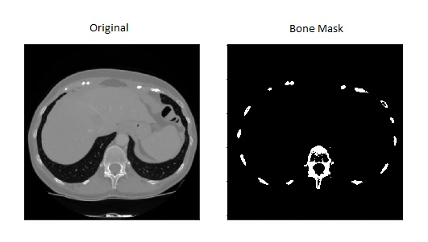
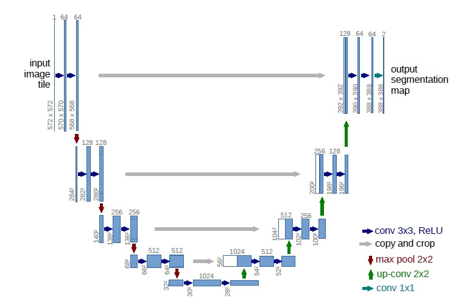

# Bone Segmentation for CT Scan #

### Author: Angelo Antonio Manzatto ###

-------------------------------------
### Problem ###

Image segmentation is a tedious, difficult but no less important initial step for medical analysis and diagnosis. 

This project focus on extracting the bones in CT scans in order to speed up the tasks executed by people involved in the medical field.

-------------------------------------
### Task ###

Develop a complete solution using Convolutional Neural Networks to extract the bones from a series of CT (Computed Tomography)

The following pipeline was adopted for this project:

* Download and process selected database from IRCAD.
* Create dataset.
* Create data augmentations techniques for pre processing steps.
* Create model (Unet)
* Train model.
* Evaluate model.
* Test a batch of samples not previously seen by the model.
* Test the model against a completly different database (VOXEL-MAN)

-------------------------------------
### Model ###

For this project I used a Unet model that act's as an encoder-decoder process. The model used here is a simpler version than the proposed one on the origianl paper (https://arxiv.org/pdf/1505.04597.pdf) since it starts with 32 channels output instead of 64 decreasing to 512 instead of 1024. 

-------------------------------------
### Results ###

Here is the final result of the applied trained model on a validation set.

-------------------------------------

This project was made using the IRCAD database

Reference: https://www.ircad.fr/research/3d-ircadb-01/
3D IRCAD - Hôpitaux Universitaires

VOXEL-Man:
https://www.voxel-man.com/segmented-inner-organs-of-the-visible-human/